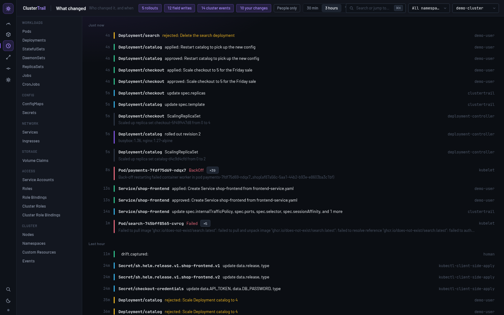

<h1 align="center">ClusterTrail</h1>

<p align="center"><strong>Git blame for your running clusters.</strong></p>

<p align="center">
  <a href="https://clustertrail.vukisha.co.ke/demo/"><strong>Try the live demo</strong></a>
  ·
  <a href="https://clustertrail.vukisha.co.ke"><strong>clustertrail.vukisha.co.ke</strong></a>
  ·
  <a href="docs/getting-started.md">Getting started</a>
  ·
  <a href="https://github.com/jameskomo/clustertrail/releases">Download</a>
</p>

<p align="center">
  <a href="https://github.com/jameskomo/clustertrail/actions/workflows/check.yml"></a>
  <a href="LICENSE"></a>
  
  
</p>

<p align="center">
  <a href="https://clustertrail.vukisha.co.ke/demo/">
    
  </a>
</p>

Something changed at 3am and nobody remembers doing it. Your monitoring can
tell you the cluster is unhealthy. It cannot tell you **what changed, who
changed it, and whether it matches Git**. ClusterTrail can, and it will not
apply anything a person has not approved.

It is also a fast everyday client, with the tables, logs, terminals and port
forwards you expect, because a tool you do not open every day cannot be the
one that catches the change nobody remembers making.

## Try it without installing anything

**→ [clustertrail.vukisha.co.ke/demo](https://clustertrail.vukisha.co.ke/demo/)**

That is the real interface, driven by recordings from a real cluster. It runs
entirely in your browser, connects to nothing, and needs no sign-up. The
project page is at
[clustertrail.vukisha.co.ke](https://clustertrail.vukisha.co.ke).

## Run it on your own cluster

Download one file from the [releases page](https://github.com/jameskomo/clustertrail/releases)
and run it. There is no installer, no daemon, and nothing to add to your
clusters.

```sh
chmod +x clustertrail-*
./clustertrail-* serve --open
```

It reads the kubeconfig you already have, lists your contexts, connects to
none of them until you pick one, and opens your browser. Full instructions,
including the macOS and Windows warnings about unsigned binaries, are in
[Install](docs/install.md).

## What it answers

| Question | How |
|---|---|
| **What changed in the last hour?** | Rollouts with the image that actually moved, the fields people edited, cluster events, and your own approved changes, merged into one ordered list. The name beside each edit comes from `managedFields`, which Kubernetes writes on every object and almost nothing shows you. |
| **What has drifted from Git?** | Point it at the directory your cluster is deployed from. You get what is in Git but not running, what differs, and what is running with no file behind it. Plain YAML, Kustomize overlays and Helm charts all render. |
| **Who approved this?** | Every write is proposed first, with a real diff from a server-side dry run and the blast radius, then a human decides. Each step lands in an append-only log where every entry carries the fingerprint of the one before it. |
| **Can AI help without breaking anything?** | There is an explain pane, and an MCP server your coding agent can read clusters through. Neither can write, because the tools that change a cluster are not in the interface the model sees. |

## How it fits together

```
  interface  ──ws://127.0.0.1?token──┐
                                     ├─ clustertrail (Go) ── your clusters
  CI  ── clustertrail drift ─────────┤    client-go, informers, timeline,
                                     │    drift, helm, change gate, audit
  coding agent ── MCP over stdio ────┘    (read-only tools only)
```

ClusterTrail talks to your clusters the way `kubectl` does. It installs
nothing in them, it inherits your RBAC, and it cannot see or do anything your
own credentials cannot. The engine listens on loopback only, on a random
port, behind a token that changes every launch.

## Use it in CI

The same drift check that runs on screen runs in a pipeline and exits
non-zero when the cluster and the repository disagree:

```sh
clustertrail drift --repo deploy --unmanaged
```

## Use it from your coding agent

```sh
claude mcp add clustertrail -- /path/to/clustertrail mcp
```

Nine read-only tools. There is no write tool to disable, because none was
written. See [MCP server](docs/mcp.md).

## Documentation

**New here? Start with [Getting started](docs/getting-started.md).** It creates
a local test cluster, runs ClusterTrail against it, and walks you through the
seven things worth trying first.

| Document | What it covers |
|---|---|
| [Install](docs/install.md) | Every way to get it running, on each platform. |
| [Getting started](docs/getting-started.md) | A test cluster, first run, and the guided tour. |
| [Features](docs/features.md) | Every screen and every capability, in detail. |
| [Command line](docs/cli.md) | `clustertrail drift` for CI, with exit codes and a pipeline example. |
| [MCP server](docs/mcp.md) | Read-only cluster access for coding agents, and why it cannot write. |
| [Security](docs/security.md) | What the engine can do, what the agent cannot, and how the audit chain works. |
| [Architecture](docs/architecture.md) | Why the engine and the interface are separate, and how each layer works. |
| [Protocol](docs/protocol.md) | The local WebSocket protocol, message by message. |
| [Development](docs/development.md) | Repository layout, the build loop, and how to add a resource kind. |
| [Design](docs/design.md) | Visual rules and tokens, for anyone touching the interface. |
| [Troubleshooting](docs/troubleshooting.md) | Problems seen while building this, and their fixes. |
| [Roadmap](docs/roadmap.md) | What is built, what is pending, and what is deliberately deferred. |
| [The site](site/README.md) | How the public page and the demo are built and published. |

## Building from source

Needs Docker, Go 1.25, Node 22 and kind. `make dev` creates a local cluster
with demo workloads if one is missing, builds the engine, and starts both
processes:

```sh
make dev
# open http://127.0.0.1:5173/?token=dev
```

[Development](docs/development.md) has the rest.

## Status

Everything in these documents is built, and was exercised against a local
Kubernetes 1.37 cluster while it was written.

**The one pending piece is the desktop shell.** ClusterTrail runs in your
browser today. The shell adds a dock icon, the system keychain and
auto-update, and changes nothing else, which is why it is last.

The cloud relay, phone approvals and the proposals engine are a separate,
later tier that stays unbuilt until teams commit to paying for it. That was
the plan from the start rather than an omission. See the
[roadmap](docs/roadmap.md).

## Contributing and security

Bug reports and patches are welcome. Read [CONTRIBUTING.md](CONTRIBUTING.md)
first. If you find a security issue, please follow [SECURITY.md](SECURITY.md)
rather than opening a public issue.

Licensed under [Apache 2.0](LICENSE).

---

<p align="center">
  <a href="https://clustertrail.vukisha.co.ke">Website</a> ·
  <a href="https://clustertrail.vukisha.co.ke/demo/">Demo</a> ·
  <a href="docs/getting-started.md">Docs</a> ·
  <a href="https://github.com/jameskomo/clustertrail/releases">Releases</a> ·
  <a href="https://github.com/jameskomo/clustertrail/issues">Issues</a>
</p>
